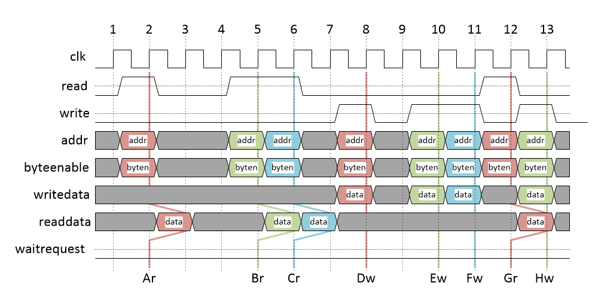
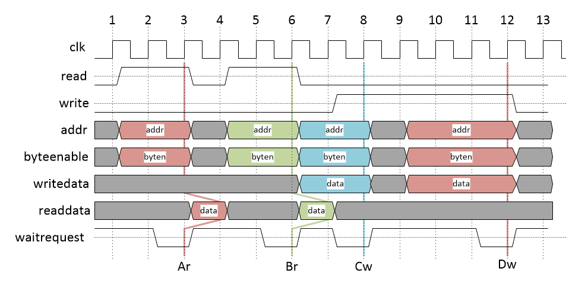
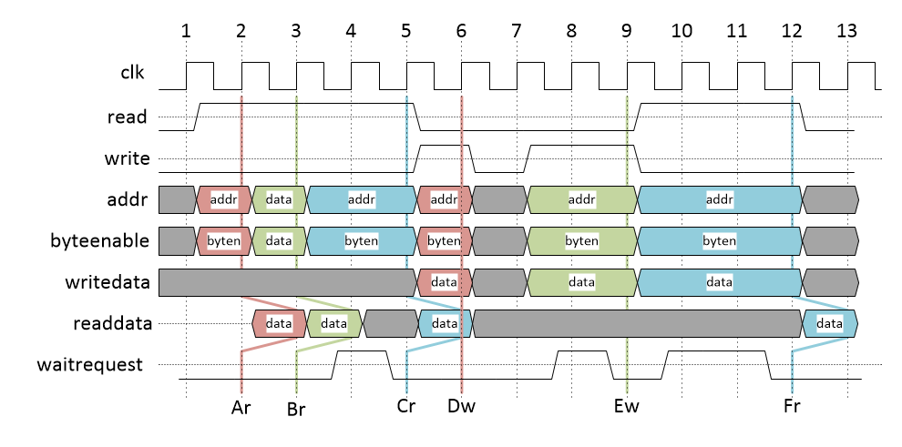

Avalon Bus Timing
=================

**Note**: These diagrams are only for the Bus interface. For the Harvard interface
the memory buses are combinatorial, and are not compliant Avalon.

When implement the Bus interface, you need to be able to interact with unknown RAMs (or
things that look like RAM). However, you do know that they will adhere to Avalon.
The [Avalon Bus Spec](https://www.intel.com/content/dam/www/programmable/us/en/pdfs/literature/manual/mnl_avalon_spec.pdf) contains some examples of timing diagrams in section 3.5.1, though it gives
only a few concrete examples. There are also many other Intel/Altera documents around that show
examples of waveforms, though they often include things we don't need here, such as
the `chipselect` signal. The diagrams below attempt to capture a number of different
transactions, and cover the most common questions that come up.

Memory that does not use `waitrequest`
--------------------------------------

The simplest case is when interacting with a RAM that does not use `waitrequest`,
so it is always ready for transactions.

All signals are clock synchronous (this is a requirement of the Avalon bus), so we
only care what the signals are doing at the clock edge. Looking along the bottom
there are labelled transactions, with an `r` suffix for a read and a `w` for a 
write. We have three reads, then three writes, then some mixed reads and writes.

Some things to notice are:

- `readdata` is valid the clock cycle after the request was made. For example, request `Ar`
  occurs at clock edge 2, but the data is valid at clock edge 3.
- Back-to-back transfers are valid, so the reads `Br` and `Cr` can occur on consecutive
  cycles.
- It is possible to mix and match back-to-back reads and writes. For example in the
  sequence `Fw`, `Gr` and `Hw`. It might look odd that on clock edge 13 both `readdata`
  and `writedata` are valid, but it is still completely safe.
- The important feature of `waitrequest` is that it is low in the cycle the request
  is being made. So for example, request `Ar` completes in one cycle because `waitrequest`
  is low at clock edge 2.

A permanently low `waitrequest` is just an example - there is no way of actually
telling whether the memory you are talking to will use wait states or not. Even
if it has previously been low, it might start inserting wait requests later. For
example, different address ranges might map to different RAMs or peripherals,
some of which don't need wait states, and some of which do.

Memory that keeps `waitrequest` high
------------------------------------

Another case is a RAM that keeps `waitrequest` high until a request is made, and
then lowers it for a cycle once the data is ready. This is common if multiple
peripherals are multiplexed into one bus in order to reduce latency.

In this case the master tries to start transaction `Ar` at clock edge 2, but
finds that `waitrequest` is asserted. It must retry the same transaction on the
next clock edge 3, as once a request is started it can't be changed. On clock
edge 3 the memory drops `waitrequest`, and so the transaction completes.

The read and write requests `Br` and `Cw` are back-to-back, which is legal
because once the master observes that `waitrequest` is low at clock edge
6 it knows that `Br` is complete. So it is allowed to immediately start
another transaction at cycle 7.

Memory with variable wait states
-------------------------------

Some memories may insert wait states in quite unpredictable ways, so they
might keep `waitrequest` low most of the time, but then occasionally assert it.

It is important to note that all signals are clock sensitive in Avalon. This
means that `waitrequest` cannot be a response to the address being given,
and must be due to some independent factor. For example, at clock edge 2
the memory can't "look" at the address and then decide to block the transaction.
It had to independently decide that `waitrequest` would be low at clock
edge 2 at the same time as the master decide to start a transaction.

As for _why_ this might happen: imagine a single-cycle memory that is connected to
two different masters via an arbiter. It might be organised such that:

- One master has high throughput, and can make transactions immediately by default.
- The other master has high priority, but has to request access to the bus.

The arbiter could expose these two ports as the two different styles:

- High-throughput : `waitrequest` is usually low allowing immediate transactions.
  `waitrequest` is only driven high temporarily when the low-priority master
  wants to make a transaction.

- High-priority : `waitrequest` is always high until the master tries to make
  a transaction. At that point, the arbiter will assert `waitrequest` on the
  high priority bus, and can complete the high priority transaction.

Most of the time the high throughput master can make transactions back-to-back
without any wait states. However, the high priority master can always interrupt
those transactions as needed, albeit with a higher latency on each transaction.

Why is byteenable needed during reads?
--------------------------------------

If you consider a memory mapped peripheral, there may well be a difference
between reading a byte at address 0x10 and reading a byte at address 0x11.
For example, they might represent two different status registers which are
cleared whenever they are read.

So we could have:

- addr=0x10, byteenable=0b0001 : Read and clear the status register at byte address 0x10.
- addr=0x10, byteenable=0b0010 : Read and clear the status register at byte address 0x11.
- addr=0x10, byteenable=0b0011 : Read and clear both status registers at 0x10 and 0x11.

As always, the CPU doesn't know what lives at a given address, it just has to
perform the loads and stores that the instruction stream tells it to.

What does this all mean for our CPU?
------------------------------------

Your CPU does not need to care about _why_ `waitrequest` might be asserted, nor
is there any way to detect whether `waitrequest` will always be low, or reactive,
or variable.

If your CPU assumes `waitrequest` is always low, then it will still pass most tests
for instruction logic, but might fail some that explicitly look for ability to
work with wait states.
